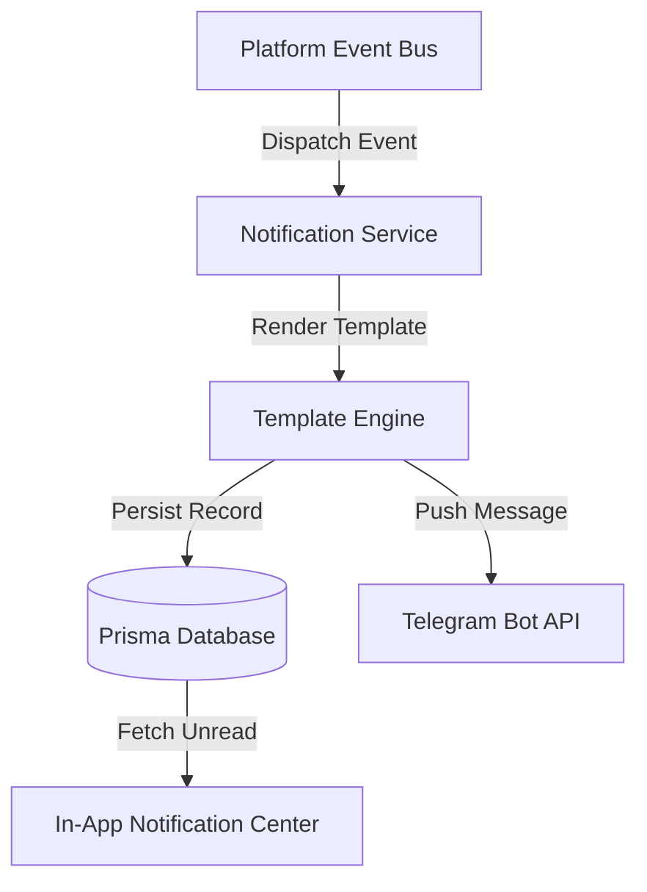

# TitanStream Event-Driven Notification System Architecture

This document details the production notification architecture for TitanStream, covering event definitions, template catalog, multi-channel delivery (In-App + Telegram Bot), and delivery preferences.

---

## 1. System Architecture

All notifications are 100% **event-driven**. When a system action occurs (e.g. deposit approved, machine activated, withdrawal requested), an event is emitted via the `EventBusService`, caught by `NotificationService`, resolved against template templates, and dispatched concurrently to DB records and Telegram push.

---

## 2. Notification Event Catalog (20 Core Events)

| # | Event Code | Trigger Event | Primary Channel | Sample Template Body |
| :--- | :--- | :--- | :--- | :--- |
| 1 | `ACCOUNT_CREATED` | User registration | In-App & Telegram | "Welcome {firstName}! Your Telegram identity node has been initialized." |
| 2 | `EDUCATION_COMPLETED` | Swiping onboarding | In-App | "You completed the Cloud Compute Education modules and earned +{reward} Crystals!" |
| 3 | `WALLET_FUNDED` | Wallet credit | In-App & Telegram | "Your wallet has been credited with {amount} {asset}." |
| 4 | `DEPOSIT_PENDING` | Payment order created | In-App | "Deposit order {reference} of {amount} {asset} is pending payment confirmation." |
| 5 | `DEPOSIT_APPROVED` | Payment completed | In-App & Telegram | "Deposit of {amount} {asset} confirmed! Funds are now available in your wallet." |
| 6 | `DEPOSIT_REJECTED` | Payment failure | In-App & Telegram | "Deposit order {reference} could not be verified. Reason: {reason}." |
| 7 | `MACHINE_PURCHASED` | Machine buy requested | In-App | "Successfully purchased {machineName} ({capacity} GH/s) for {price} USDT." |
| 8 | `MACHINE_ACTIVATED` | Machine operational | In-App & Telegram | "🎉 {machineName} is now ACTIVE and generating daily compute yields 24/7!" |
| 9 | `DAILY_EARNINGS` | Midnight yield credit | In-App & Telegram | "Your active cloud machines generated {amount} USDT ({localYield}) in daily yield today!" |
| 10 | `WITHDRAWAL_REQUESTED`| Payout requested | In-App & Telegram | "Withdrawal request of {amount} USDT to network {network} is pending operator approval." |
| 11 | `WITHDRAWAL_APPROVED` | Payout approved | In-App & Telegram | "Your withdrawal request of {amount} USDT has been approved and queued for dispatch." |
| 12 | `WITHDRAWAL_REJECTED` | Payout rejected | In-App & Telegram | "Withdrawal request {reference} was rejected. Funds returned to your available balance." |
| 13 | `REFERRAL_JOINED` | Partner signup | In-App & Telegram | "User {username} joined TitanStream using your referral link!" |
| 14 | `REFERRAL_MILESTONE` | Tier target reached | In-App & Telegram | "Congratulations! You reached the {milestone} referral milestone and earned +{bonus} USDT!" |
| 15 | `SUPPORT_UPDATE` | Support ticket reply | In-App | "An update was posted to your support ticket #{ticketId}: \"{responseSnippet}\"." |
| 16 | `PLATFORM_ANNOUNCEMENT`| Admin broadcast | In-App & Telegram | "{announcementText}" |
| 17 | `SYSTEM_MAINTENANCE` | System status alert | In-App & Telegram | "Scheduled maintenance starting {scheduledTime}. Computing yields continue uninterrupted." |
| 18 | `MISSION_CONTROL_ALERT`| Telemetry alert | In-App | "[Mission Control] {alertMessage} (Level: {severity})." |
| 19 | `ADMIN_ACTION` | Admin adjustment | In-App | "An administrative action was recorded on your account: {actionDetails}." |
| 20 | `SETTLEMENT_CREATED` | MoMo request start | In-App | "Funding request initialized for {amount} {asset}. Awaiting verification." |
