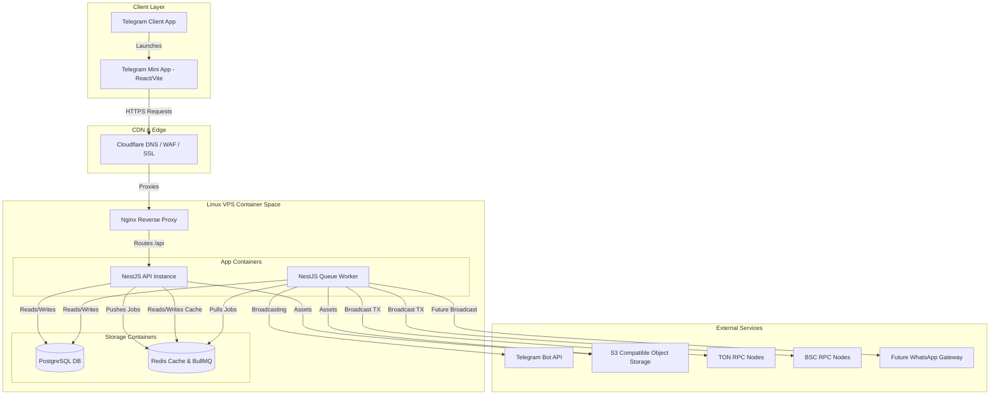

# Document A: Complete System Architecture

This document outlines the system topology, data flows, and security trust boundaries for the TitanStream platform.

---

## 1. System Topology Diagram

The system employs a client-server architecture hosted on a Linux VPS with Cloudflare DNS proxying, Nginx reverse proxying, and container isolation via Docker.



---

## 2. Component System Descriptions

### 2.1 Client Layer (Telegram Mini App)
* **Technology:** React (TypeScript) compiled via Vite, styled using TailwindCSS.
* **Role:** Serves the UI, handles user input (cooler taps, navigation), runs the local mining balance ticker, and interacts with the NestJS API via standard Axios clients.
* **Integrations:** Imports `window.Telegram.WebApp` SDK to access device-level metrics, sharing utilities (stories, referral link dispatch), and handle invoices.

### 2.2 Backend Layer (NestJS Services)
* **NestJS API Service:** Exposes HTTP endpoints for authorization, user sync, quest submissions, and withdrawal requests. Runs in stateless container instances.
* **NestJS Queue Worker:** A background daemon listening to Redis queues. Processes heavy cron tasks, referral commissions, game RNG verifications, message broadcasting, and blockchain transactions.

### 2.3 Storage Layer
* **PostgreSQL (via Prisma ORM):** Persistent, transactional data store hosting accounts, wallets, ledger requests, and quest configurations.
* **Redis:** In-memory caching and lock database. Hosts current user mining sessions for fast real-time multiplier reads. Drives **BullMQ** for job processing and queue backoffs.

---

## 3. Communication Protocols

* **Client to Backend API:** HTTPS (TLS 1.3) REST endpoints. Data formatted exclusively in JSON payloads.
* **Backend to Redis:** TCP connections using Redis serialization protocol (RESP), secured inside the Docker network interface.
* **Backend to PostgreSQL:** Secure TCP connection pools routed via Prisma ORM client.
* **Worker to Telegram Bot API:** Outgoing HTTPS requests targeting `https://api.telegram.org/bot<token>`.

---

## 4. Trust Boundaries & Security Perimeters

```
[ Telegram Client (Untrusted) ]
             |
             |  initData Payload
             v
======================================= SECURITY PERIMETER =======================================
             |
             | Verified by SHA-256 HMAC
             v
[ NestJS API Gateway (Trusted Root) ] <---> [ Database & Redis Containers (Internal Network) ]
```

* **Client Boundary (Untrusted):** The React client running inside the user's Telegram container is considered fully untrusted. All calculations, state transitions, game scores, and withdrawal eligibility must be re-verified on the server.
* **Network perimeter (Trusted):** PostgreSQL, Redis, and worker containers do not expose open ports to the internet. Access is restricted strictly to internal Docker network routing. Nginx serves as the single ingress controller.
* **Data Boundary (InitData Verification):** Every transaction must verify the user's identity by re-hashing the `initData` signature at the API gateway layer on each request.
