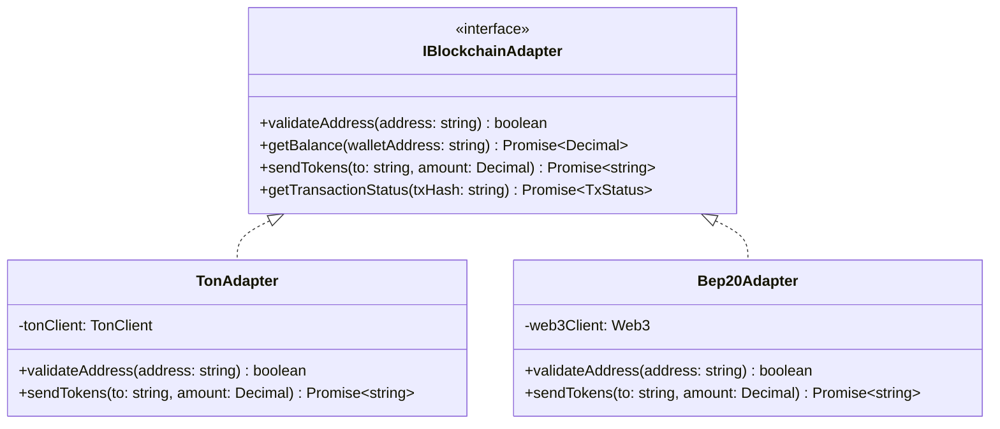

# Document I: Wallet Architecture

This document defines the ledger structures, balances segmentation, auditing controls, and blockchain abstraction layers for financial operations.

---

## 1. Ledger Balance Segmentation

User wallets contain multiple balance categories to guarantee transactional safety, especially during active withdrawals.

* **Available Balance:**Mined tokens that are liquid and can be spent on in-game items, games, or withdrawals.
* **Pending Balance:**Unconfirmed referral commissions or dispute-locked balances.
* **Locked Balance:**When a user submits a withdrawal request (e.g. for `15 USDT`), this amount is immediately subtracted from the *Available Balance* and added to the *Locked Balance* during queue processing. This prevents the user from double-spending or playing games with tokens currently in transit.
* **Withdrawn Balance:**Cumulative sum of historically completed withdrawals.

---

## 2. Double-Entry Accounting Ledger

To prevent balance discrepancies (e.g., race conditions during simultaneous API calls), the database uses a transactional ledger design. Balances are not updated by simple additions; they are derived from a ledger table of balance credits and debits.

### 2.1 Ledger Schema Entity (`wallet_ledger_entries`)
* `id` (UUID, Primary Key)
* `wallet_id` (UUID, Foreign Key)
* `amount` (Decimal, positive for credit, negative for debit)
* `type` (Enum: `MINING_YIELD`, `REFERRAL_COMMISSION`, `WITHDRAWAL_LOCK`, `WITHDRAWAL_CONFIRM`, `WITHDRAWAL_VOID`, `GAME_COST`, `GAME_WIN`)
* `reference_id` (String, Nullable: holds links to quest UUIDs, game session IDs, or withdrawal request IDs)
* `created_at` (Timestamp)

---

## 3. Blockchain Abstraction Layer

TitanStream uses a Strategy pattern to interface with blockchain networks. The core code interacts with a generic interface, while specific clients handle network RPC details.

---

## 4. Multi-Chain and Future Expansion Strategy

To support future blockchain expansions (e.g. Solana, Polygon, Ethereum) without redesigning core databases:

* **Dynamic Strategy Registry:**
  * Adapters are registered in a NestJS DI container under a token registry.
  * When a withdrawal is processed, the system retrieves the adapter dynamically based on the network enum value:
    `const adapter = this.adapterRegistry.get(request.network);`
* **Address Format Normalization:**
  * The ledger database stores the destination address as a generic string field. Blockchain-specific validation and encoding (e.g. Hex for BEP20, base64url for TON) are isolated inside the adapters.
