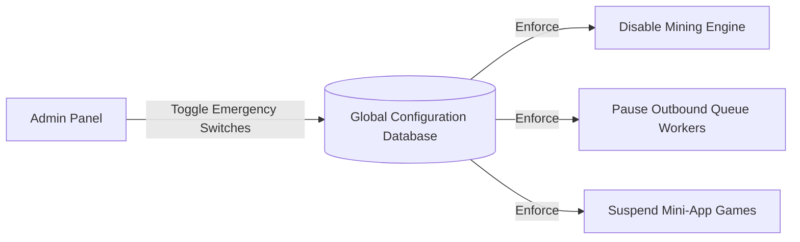

# Document O: Admin Architecture

This document defines the back-office panel layout, Role-Based Access Control (RBAC) levels, audit trails, and emergency controls.

---

## 1. Role-Based Access Control (RBAC)

Administrative privileges are enforced at the API route level using NestJS guards.

| Role | Permissions | Allowed Endpoints |
|---|---|---|
| **USER** | Read profile, tap cooler, play games, request withdrawals | `/api/v1/user/*`, `/api/v1/mining/*`, `/api/v1/withdraw` (post) |
| **ADMIN** | User audits, approve withdrawals, edit quests, broadcast notifications, configure variables, toggle emergency locks | `/api/v1/admin/*` |

---

## 2. Admin Interface Components

The admin portal is a separate single-page application (`apps/admin-dashboard`) built with React and Tailwind CSS. It communicates with `/api/v1/admin/*` routes.

### 2.1 User Management Page
* **Functionality:** Search users by Telegram ID or username, view full transaction ledgers, adjust crystal balances, check active speed boosts, and ban accounts (by soft-deleting).

### 2.2 Withdrawal Payout Manager
* **Functionality:** Log of pending, processing, completed, and failed withdrawals. Displays user risks metrics (velocity scores, referral validity).
* **Actions:**
  * **Approve:** Signs and broadcasts the crypto transaction to the blockchain.
  * **Reject:** Returns the locked balance back to the user's available balance and records the reason.

### 2.3 Quest and Campaign Portal
* **Functionality:** CRUD interface for the `Quest` table. Allows admins to register new partner channels, configure target parameters, adjust rewards, and define launch periods.

### 2.4 Real-Time Statistics Panel
* **Metrics:** Daily Active Users (DAU), Monthly Active Users (MAU), total mined USDT/TON, current active hot wallet balance reserves, and queue latency.

---

## 3. System Configuration & Emergency Actions

To defend the platform against security exploits, smart contract vulnerabilities, or market crashes, the administration module contains direct emergency switches.

* **Emergency Actions Interface:**
  * **Disable Outbound Withdrawals:** Instantly pauses the BullMQ `withdrawal-queue` processor, stopping hot wallets from executing transfers.
  * **Halt Mining:** Sets active mining rate modifiers to `0`, preventing balances from accumulating.
  * **Suspend Game Play:** Closes mini-game entrances on the client.
* **Audit Trail Policy:**
  * All admin activities, especially emergency toggles and manual balance adjustments, must write a record to the `AuditLog` table containing the administrator's account details, IP, and a JSON payload of modified values.
