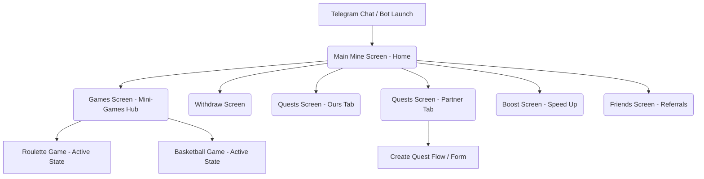

# Document 1: Complete Screen Inventory

This document catalogs every screen identified from the reference screenshots of the TitanStream Telegram Mini App, detailing their purposes, hierarchy, and entry points.

## Screen Hierarchy Overview

---

## Screen Inventory Details

### 1. Main Mine Screen (Home / Dashboard)
* **Screen Name:** `Mine Screen`
* **Primary Purpose:** Serves as the central hub of the application. It manages the core mining lifecycle (USDT and TON), displays the mining rate in GH/s, represents the active cooler multiplier slider, and holds direct navigation cards to Boost and Friends.
* **Navigation Entry:** The default landing screen when the Telegram Mini App is launched. It is also accessible by clicking the "Mine" tab in the bottom navigation bar from any other screen.
* **Parent Screen:** Telegram WebApp container (root).
* **Child Screens:**
  * `Boost Screen` (via bottom navigation or "Boost miner" card)
  * `Friends Screen` (via bottom navigation or "Invite a friend" card)
  * `Quests Screen` (via bottom navigation)
  * `Withdraw Screen` (via bottom navigation)
  * `Games Screen` (via gamepad controller icon in the header)
* **Status Details:** Features two sub-states toggleable at the top:
  * **USDT Mining State:** Shows Tether logo spinner and USDT balance (audited in `photo_3_2026-07-28_08-36-53.jpg`).
  * **TON Mining State:** UNKNOWN — Requires additional reference (the screen layout for TON mode is not shown, but is indicated by the TON toggle option).

### 2. Games Screen (Mini-Games Hub)
* **Screen Name:** `Games Screen`
* **Primary Purpose:** Presents a list of interactive mini-games where users can play to win USDT, Crystals, or miner speed boosts.
* **Navigation Entry:** Tapping the Gamepad Controller icon in the upper-right corner of the top header bar on any screen.
* **Parent Screen:** `Mine Screen` (or current screen holding the header).
* **Child Screens:**
  * `Roulette Game` (implied entry via "Play >" button; active game interface is `UNKNOWN — Requires additional reference`).
  * `Basketball Game` (implied entry via "Play >" button; active game interface is `UNKNOWN — Requires additional reference`).

### 3. Withdraw Screen
* **Screen Name:** `Withdraw Screen`
* **Primary Purpose:** Allows users to initiate cryptocurrency withdrawals of their earned USDT to external wallets on the TON or BNB Smart Chain (BEP20) networks.
* **Navigation Entry:** Tapping the "Withdraw" tab in the bottom navigation bar.
* **Parent Screen:** `Mine Screen`.
* **Child Screens:** None visible.
* **Status Details:** Contains a withdrawal history section titled "Your withdrawal requests" (currently showing an empty state).

### 4. Quests Screen (Ours Tab)
* **Screen Name:** `Quests Screen - Ours`
* **Primary Purpose:** Lists in-house quests and tasks created by the platform (e.g. daily logins, referrals, home screen shortcuts, and posting stories) which reward the user with miner speed boosts or crystals.
* **Navigation Entry:** Tapping the "Quests" tab in the bottom navigation bar.
* **Parent Screen:** `Mine Screen`.
* **Child Screens / Siblings:**
  * `Quests Screen - Partner Tab` (accessible by clicking the "Partner" tab in the sub-header).
  * Category Pills (e.g., "Daily login", "Friends", "Taps", "Home screen") filter the tasks list.

### 5. Quests Screen (Partner Tab)
* **Screen Name:** `Quests Screen - Partner`
* **Primary Purpose:** Displays advertisement campaigns and third-party sponsored tasks (e.g. subscribing to partner Telegram channels) which reward the user with crystals.
* **Navigation Entry:** Tapping the "Quests" tab in the bottom navigation bar, then clicking the "Partner" tab in the sub-header.
* **Parent Screen:** `Mine Screen` / `Quests Screen`.
* **Child Screens:**
  * `Create Quest Screen` (implied link on the "Create quest" card; interface is `UNKNOWN — Requires additional reference`).

### 6. Boost Screen (Speed Up Page)
* **Screen Name:** `Boost Screen`
* **Primary Purpose:** Allows users to purchase mining speed packages (Boost packs) to temporarily increase their daily USDT mining rate.
* **Navigation Entry:** Tapping the "Boost" tab in the bottom navigation bar, or clicking the "Boost miner" action card at the bottom of the Mine screen.
* **Parent Screen:** `Mine Screen`.
* **Child Screens:** None. Offers 5 distinct packages (x2, x3, x5, x10, x20).

### 7. Friends Screen (Referrals Page)
* **Screen Name:** `Friends Screen`
* **Primary Purpose:** Manages the referral program, displaying referral counts, referral mining speed boosts, and total USDT/TON referral earnings. It also provides copy and share utilities for the referral link.
* **Navigation Entry:** Tapping the "Friends" tab in the bottom navigation bar, or clicking the "Invite a friend" card at the bottom of the Mine screen.
* **Parent Screen:** `Mine Screen`.
* **Child Screens:** None. Shows referral list (currently in empty state).
