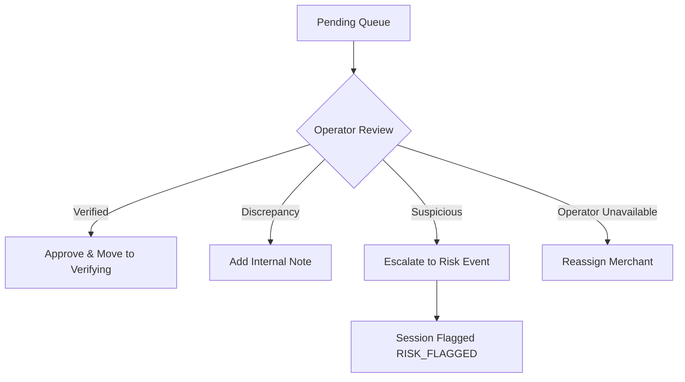

# Operations Control Plane Admin Workflows

## 1. Settlement Review & Escalation

- **Reviewing a Settlement**: An `OPERATIONS_ADMIN` inspects payment proofs, adds notes via `POST /admin/settlements/:id/review`, and advances session status.
- **Escalation**: Escalating via `POST /admin/settlements/:id/escalate` creates a HIGH-severity `RiskEvent` and transitions the settlement to `RISK_FLAGGED`.
- **Merchant Reassignment**: In cases of merchant delay or network error, `POST /admin/settlements/:id/reassign` re-allocates the session to an eligible active operator.

## 2. Sensitive Actions & Audit Controls

All sensitive actions (`MERCHANT_SUSPEND`, `USER_FREEZE`, `SETTLEMENT_PAUSE`) require:
1. Valid session with required permission.
2. Explicit `reason` string in body.
3. Automated audit logging into `OperationalAuditLog`.
